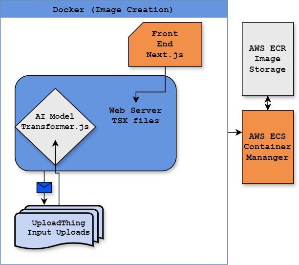

# AI-Powered Image Object Detection App

A Next.js application that uses AI to detect and classify objects in images. Upload an image and get instant results showing what objects are detected and how many of each type.

## 🌟 Features

- **AI Object Detection**: Powered by Hugging Face's Transformers.js library using the DETR ResNet-50 model
- **Real-time Processing**: Instant object detection with confidence scoring
- **Image Storage**: Automatic upload and storage using UploadThing and AWS ECR
- **Confidence Filtering**: Only displays objects detected with >80% confidence
- **Object Counting**: Automatically counts multiple instances of the same object

## 🏗️ Architecture

The application follows a containerized architecture deployed on AWS:



### Component Flow
1. **Frontend (Next.js)**: User interface for image upload and result display
2. **Web Server**: Processes requests and serves TSX files
3. **AI Model**: Xenova/detr-resnet-50 for object detection
4. **UploadThing**: Handles file uploads and temporary storage
5. **AWS ECR**: Stores Docker images
6. **AWS ECS**: Manages and orchestrates containers

## 🚀 Getting Started

### Prerequisites
- Node.js 18+ 
- npm or yarn
- UploadThing account and API keys
- AWS account (for deployment)

### Installation

1. Clone the repository:
```bash
git clone https://github.com/aleung910/Object_Detect_App.git
cd Object_Detect_App
```

2. Install dependencies:
```bash
npm install
# or
yarn install
```

3. Set up environment variables:
Create a `.env.local` file in the root directory:
```env
UPLOADTHING_SECRET=your_uploadthing_secret
UPLOADTHING_APP_ID=your_app_id
```

4. Run the development server:
```bash
npm run dev
# or
yarn dev
```

5. Open [http://localhost:3000](http://localhost:3000) in your browser

## 📖 Usage
1. Navigate to the home page
2. Click "Upload Object Image" button
3. Select an image file (.png or .jpg)
4. Click upload and wait for processing
5. View detected objects and their counts

## Technology Stack

### Frontend
- **Next.js 14**: React framework with App Router
- **TypeScript**: Type-safe development
- **Tailwind CSS**: Utility-first styling
- **Shadcn/ui**: Component library

### AI/ML
- **Transformers.js**: Hugging Face library for browser-based ML
- **DETR ResNet-50**: Object detection model
- **Pipeline API**: Simplified model inference

### Backend/Infrastructure
- **UploadThing**: File upload handling
- **AWS ECR**: Docker image registry
- **AWS ECS**: Container orchestration
- **Docker**: Containerization

## 📁 Project Structure

```
Object_Detect_App/
├── app/
│   ├── api/
│   │   └── detect-objects/
│   │       └── route.ts          # Object detection API endpoint
│   ├── image-classification/
│   │   └── page.tsx              # Main upload/detection page
│   ├── styles/
│   │   └── global.css            # Global styles
│   └── page.tsx                  # Home page
├── components/
│   └── ui/                       # Reusable UI components
├── utils/
│   └── uploadthing.ts            # UploadThing configuration
├── public/
│   ├── diagram.png               # Architecture diagram
│   └── paperTexture.jpg          # Background texture
└── package.json
```

## 🔧 API Reference

### POST /api/detect-objects

Detects objects in an uploaded image.

**Request:**
- Content-Type: `multipart/form-data`
- Body: FormData with `files` field

**Response:**
```json
{
  "url": "https://uploadthing.com/...",
  "label": "{\"person\":2,\"chair\":4}"
}
```

## 🎯 Key Features Explained

### Confidence Filtering
Only objects detected with >80% confidence are included in results:

```typescript
outPut.forEach(({ score, label }: any) => {
  if (score > 0.80) {
    // Count and display object
  }
});
```

### Object Counting
Automatically aggregates multiple detections of the same object type:

```typescript
if (countObj[label]) {
  countObj[label]++;
} else {
  countObj[label] = 1;
}
```

## 🐳 Docker Deployment

Build and run the Docker container:

```bash
# Build image
docker build -t object-detect-app .

# Run container
docker run -p 3000:3000 object-detect-app
```

## 🌐 AWS Deployment

1. Push Docker image to ECR
2. Create ECS task definition
3. Deploy to ECS cluster
4. Configure load balancer and domain

## 📝 License
This project is open source and available under the MIT License.

## 🙏 Acknowledgments

- [Hugging Face](https://huggingface.co/) for Transformers.js
- [UploadThing](https://uploadthing.com/) for file upload handling
- [Xenova](https://github.com/xenova) for the DETR ResNet-50 model
- [Shadcn](https://ui.shadcn.com/) for UI components
